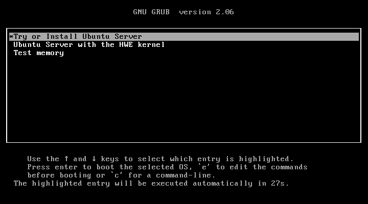

# Ubuntu Development Environment

## LiveCD Installation

### Download Ubuntu Server


### Create a Virtual Machine (VM)

I'm using GNOME Boxes,
but you can use other hypervisors like VirtualBox or VMWare:


I increased the default RAM to 8GB and storage to 80GB:


### Boot the VM



#### Follow the installation wizard


I selected `continue without updating`:


I added `Search for third-party drivers`:


I omitted `LVM`:


Your partitioning should look something like this:


Set up something super basic for your user:


Skip the Ubuntu Pro advertisement:


Add your GitHub SSH keys, so you can immediately SSH into your VM afterward:


No third-drivers needed for my VM, but your mileage may vary:


Don't tick any of these:


Once complete, you'll see this:


Remove your installation media:


## Post Installation

This first part is a bit iffy.

When the system boots, you'll see a bunch of output related to your SSH keys.
Ignore the output and hit `Enter` to get a prompt, maybe you'll get `Login incorrect`.
After that, enter your username and password to log in:


Enter `ip a` to get your IP address. Usually the default network interface is `enp1s0`.
Take the `inet` or `inet6` address and SSH into your VM from your host.

From your host (i.e. Windows/macOS/etc.), SSH into your VM:

`ssh <username>@<ip-address>`

### Prompt on apt-get upgrade

Once you're in, you can copy-paste commands.

Update the system:

```sh
DEBIAN_FRONTEND=noninteractive \
sudo apt-get update  -y -qq && \
sudo apt-get upgrade -y -qq
```

**IF** you see this:


Select `<Ok>`.

Next, manually install `curl` and `wget`. `curl` is installed by default on
Ubuntu Server, but wget is not. But on Docker Ubuntu or WSL2, you might get
the opposite result. We resolve this by installing both, along with git:

```sh
DEBIAN_FRONTEND=noninteractive sudo apt-get install -y -qq curl git wget
```

### Rest of script

```sh
wget -qO- https://raw.githubusercontent.com/mkamsani/CSIT321-FYP-Ubuntu/main/install.sh | sh
```

